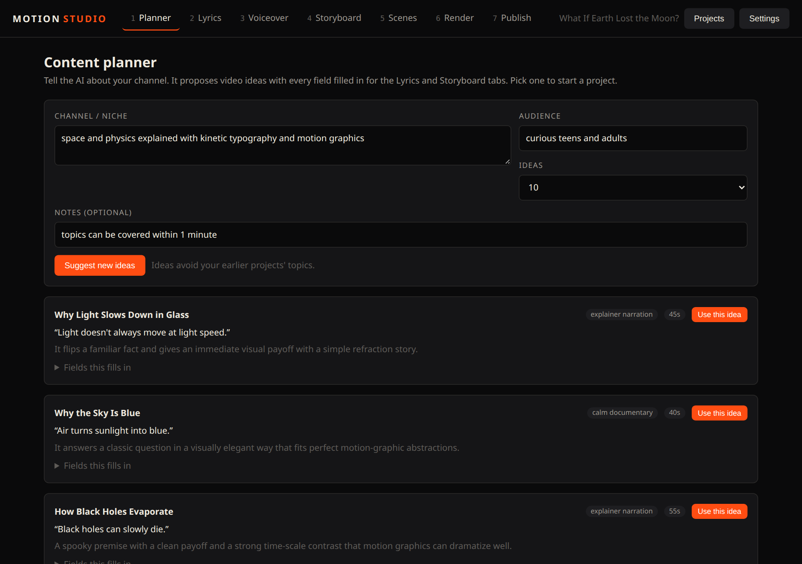
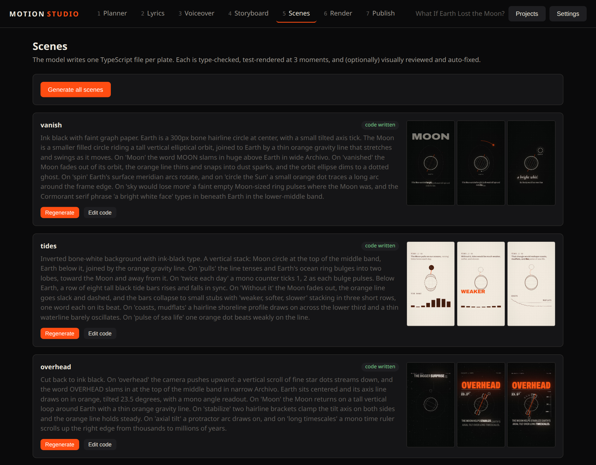
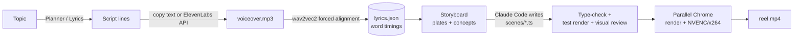

# Motion Studio

**A self-hosted studio that turns a topic into a voiced, 9:16 motion-graphics short — with [Claude Code](https://claude.com/claude-code) writing the animation code on your own machine.**

Plan an idea → write the script → add a voiceover → let Claude Code build one animated scene per beat → render an MP4 for Reels, Shorts and TikTok. Everything runs locally; there is no hosted service and no per-video fee beyond the AI tools you already use.

<p align="center"></p>

## What it is

Motion Studio is a small web app (`bun studio/server.js`, served at `http://localhost:4000`) wrapped around a deterministic WebGL/Canvas renderer. You drive it from the browser; behind it, your **locally installed Claude Code** (`claude -p`) writes TypeScript scene files, type-checks them, test-renders stills, looks at the stills, and fixes layout problems — then a parallel renderer turns the result into a 60 fps MP4.

Good for:

- **YouTube Shorts / Instagram Reels / TikTok** explainers and "what if" videos
- **Short (≤ 1 minute) ad and product spots** with kinetic typography and diagrams
- Anyone who wants a repeatable, scriptable video pipeline instead of a timeline editor

It is a *self-hosted* tool: you run the server on your machine, your files stay on your disk, and your API keys never leave `studio/settings.json`.

## Features

| Tab | What it does |
|---|---|
| **1 Planner** | Describe your channel; get video ideas with the hook line, script notes and art direction already filled in. Avoids topics you have already made. |
| **2 Lyrics** | Topic → voiceover script (≤ 60 s). Edit line by line. One-click copy of ElevenLabs-ready text (numbers and acronyms respelled, pause tags added). |
| **3 Voiceover** | Upload an MP3 — **or** generate it with the ElevenLabs API (optional, see below). Word-level forced alignment gives the exact time of every word. |
| **4 Storyboard** | The script is split into *plates* (scenes), each with a visual concept. Edit them. Choose 9:16 or 16:9. |
| **5 Scenes** | Claude Code writes one `.ts` file per plate, type-checks it, renders stills, reviews them visually and auto-fixes, up to 4 attempts. Regenerate or hand-edit any plate. |
| **6 Render** | Live preview (the same code as the export) and a fast parallel MP4 render. |
| **7 Publish** | YouTube Shorts title options, description, tags, hashtags and a pinned comment written from your script. |

Also: archive/restore whole projects, a hot-reloading preview, a deterministic engine (every frame is a pure function of time), motion blur, bloom/grain post-processing.

<p align="center"></p>

## How it works



The key idea: the voiceover is aligned to the script **before** any animation is written, so every plate can sync its motion to the real time each word is spoken. See [docs/data-files.md](docs/data-files.md) for the JSON files this produces and [docs/architecture.md](docs/architecture.md) for the full design.

## Requirements

| Needed | Why |
|---|---|
| [bun](https://bun.sh) | runs the server, the renderer script and the Vite dev server |
| [Claude Code](https://claude.com/claude-code), installed and logged in | writes the scenes (and, optionally, the script/planner/metadata). Any plan that can run `claude -p` |
| Google Chrome (or Chromium) | headless rendering |
| ffmpeg with libx264 | encoding and audio handling (NVENC is used automatically when available) |
| Python 3.9+ | the alignment model (onnxruntime + numpy) |
| A GPU is helpful, not required | rendering uses WebGL; any GPU Chrome can use works |

Developed and tested on Linux. macOS should work (the engine was originally built on a Mac; the renderer picks Metal there), but it is less tested. On Windows use WSL2 (untested).

Optional:

- **OpenAI API key** — only if you choose OpenAI as the writing or scene engine. With Claude Code as the engine you need no OpenAI key at all.
- **ElevenLabs API key** — only if you want the app to generate the voiceover (see below). Otherwise upload any MP3.

## Quick start

```sh
git clone https://github.com/JD-Tensor/motion-studio.git
cd motion-studio
bun run setup          # checks tools, creates the Python env, installs deps, downloads the alignment model (~95 MB)
bun run studio         # http://localhost:4000
```

Then open **Settings** and pick your engines:

- **Writing engine** (lyrics, planner, publish) and **Scene engine** (storyboard, scene code, visual review): *Claude Code* needs no key. Pick a model from the dropdown — it lists whatever your installed Claude Code offers.
- Or choose OpenAI and paste an API key.

Walk the tabs left to right. Generating the scenes takes a few minutes; rendering a ~1-minute reel took about 5 minutes on the laptop in [Performance](#performance).

## Voiceover with ElevenLabs (optional)

Off by default. In **Settings → Generate voiceover with the ElevenLabs API**, turn the toggle on and paste your key; then **Connect** loads your voices and models. The **Voiceover** tab then gets a *Generate voiceover* card (voice, model, stability/similarity/style/speed, automatic pauses between lines, alignment afterwards). With the toggle off the app behaves exactly as before: copy the ElevenLabs text from the Lyrics tab and upload the MP3 yourself.

**Does it work on a free ElevenLabs account?** Yes, with limits (as of writing — check [ElevenLabs pricing](https://elevenlabs.io/pricing) for current terms):

- The free plan includes API access and **10,000 credits per month** — roughly 10 minutes of speech, i.e. about ten 60-second videos. Studio shows your remaining credits and refuses to send a script that would exceed them.
- **Commercial use is not permitted on the free plan.** If you make ads or monetised channels, you need a paid plan. Review ElevenLabs' terms yourself.
- Premade voices work on every plan. Some library/cloned voices need a paid plan and return a clear "needs a paid plan" message.
- Free-plan requests are rate limited; the app tells you if you hit it.

Details and troubleshooting: [docs/elevenlabs.md](docs/elevenlabs.md).

## Performance

Measured on an 8-core laptop with an RTX 2050 (4 GB) — a 67-second 1080×1920 / 60 fps reel with adaptive motion blur:

| | Time |
|---|---|
| Full render (3 Chrome workers + NVENC) | **≈ 5 min** |
| Same render before the fast canvas-upload path | ≈ 35 min |

Why it is fast: the 2D canvas is uploaded to the GPU as a plain RGBA8 texture (a GPU copy, about 0.4 ms) instead of an sRGB texture (a CPU round trip, about 23 ms), the frame range is split across several Chrome processes, and H.264 is encoded on the GPU when available. Details in [docs/architecture.md](docs/architecture.md#render-speed).

## Configuration

Everything is configured from the UI; secrets are stored in `studio/settings.json` (git-ignored, mode 600). Environment variables override:

| Variable | Meaning |
|---|---|
| `STUDIO_PORT` | server port (default `4000`) |
| `STUDIO_HOST` | bind address (default `127.0.0.1`, local only) |
| `OPENAI_API_KEY`, `OPENAI_MODEL` | OpenAI key / default model |
| `ELEVENLABS_API_KEY` | ElevenLabs key |
| `CLAUDE_BIN` | path to the `claude` executable if it is not on `PATH` |
| `CHROME_GPU=intel` | on Linux hybrid-graphics laptops the renderer offloads Chrome to the NVIDIA GPU; set this to opt out |
| `BROWSER_CHANNEL` | Playwright channel for rendering (default `chrome`) |

## Repository layout

```
studio/        the web UI + server (bun): planner, lyrics, TTS, jobs, scene generation, publish
app/           the renderer: three.js/Canvas2D engine, scene kit, offline renderer (bun + Vite)
  src/scenes/    _kit.ts (the API the AI writes against) + your generated scenes
analysis/      alignment (wav2vec2 CTC) and audio analysis (Python)
scripts/       setup and model download
docs/          architecture, data files, writing scenes, ElevenLabs, troubleshooting
data/, audio/  your current project's working files (git-ignored)
projects/      archived projects (git-ignored)
```

## Privacy and security

- The server binds to `127.0.0.1` by default. Do not expose port 4000 to a network — it can run commands (`ffmpeg`, `claude`, Chrome) and read your project files. See [SECURITY.md](SECURITY.md).
- When an engine is OpenAI or ElevenLabs, your script text is sent to that provider. With Claude Code, requests go through your own Claude Code session.
- Generated scenes are code that runs in a headless browser on your machine. Skim anything you did not write before rendering.

## Contributing

Issues and pull requests are welcome — see [CONTRIBUTING.md](CONTRIBUTING.md). Run `bun run check` before opening a PR.

## Credits and license

Motion Studio's own code is released under the [MIT License](LICENSE). **The rendering engine and visual language are not ours:** they come from [pdoom-video](https://github.com/mexicat/pdoom-video) by Giacomo Magnanini (MIT, see [LICENSE.pdoom-engine](LICENSE.pdoom-engine)), and all credit for that work belongs to him. See [NOTICE](NOTICE). Fonts, the alignment model and other third-party components are listed in [THIRD_PARTY_NOTICES.md](THIRD_PARTY_NOTICES.md).

"Claude" and "Claude Code" are products of Anthropic; ElevenLabs and OpenAI are their respective owners' trademarks. This project is independent and not affiliated with or endorsed by them.
